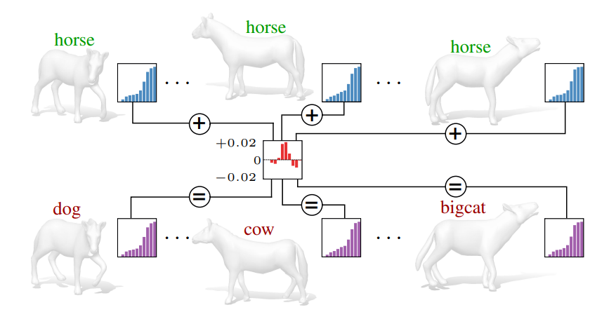

# Universal Spectral Adversarial Attacks [[Paper]](https://openaccess.thecvf.com/content/CVPR2021/papers/Rampini_Universal_Spectral_Adversarial_Attacks_for_Deformable_Shapes_CVPR_2021_paper.pdf)

This repository is the PyTorch implementation of the paper:

**Universal Spectral Adversarial Attacks for Deformable Shapes**
<br> Arianna Rampini, Franco Pestarini, Luca Cosmo, Simone Melzi, Emanuele Rodolà <br>
[CVPR, 2021](https://cvpr2021.thecvf.com/).

<p align="center">
  
</p>


## Data

The shapes used in this example (in ```dataset```) are from the [SMAL dataset](https://smal.is.tue.mpg.de/).
